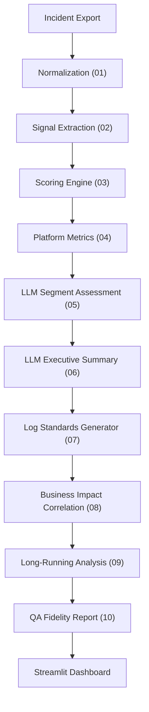

# Log Fidelity Assessment: Developer & POC Guide

This guide explains the internal structure of the Log Fidelity Assessment POC. The goal is to assess whether production monitoring incidents contain enough information for fast troubleshooting, accurate RCA, and future self-healing automation.

---

## Architecture Overview



---

## Chapter 1: Orchestration (`run_pipeline.py`)

**What we are doing**: Running the full assessment lifecycle with one command.

**How we are doing it**: Python executes each step sequentially using `subprocess`. If any script fails, the pipeline stops immediately. It ensures the whole 10-step pipeline creates outputs under `data/output/`.

---

## Chapter 2: Normalization (`src/01_normalize_incidents.py`)

**What we are doing**: Converting ServiceNow-style incident exports into a canonical schema.

**How we are doing it**: The script maps columns like `Number`, `Created`, `Resolved`, `Short description`, `Description`, `Work notes`, and `Close notes` into stable fields used by the rest of the pipeline. Computes `MTTR_Minutes` and maps the `Ticket_Lifecycle` category (e.g. Actionable Alert vs. Auto-Resolved Noise vs. Monitoring Blind Spot) based on creator vs. closer identities.

---

## Chapter 3: Signal Extraction (`src/02_extract_log_signals.py`)

**What we are doing**: Detecting whether the incident contains important log-fidelity signals.

**How we are doing it**: Regex patterns scan the combined short description, description, work notes, close notes, and ownership fields for 11 vital signals including `Has_Timestamp`, `Has_Error_Code`, `Has_Correlation_ID`, and `Has_RCA`.

---

## Chapter 4: Scoring Engine (`src/03_score_log_fidelity.py`)

**What we are doing**: Giving every incident a log quality score out of 100.

**How we are doing it**: Each dimension (Technical Completeness, Granularity, Actionability, RCA Readiness, Trustworthiness, Automation Readiness) is scored from the extracted signals and multiplied by a business weight. Groups into Quality Buckets: Poor, Needs Improvement, Good, Excellent.

---

## Chapter 5: Platform Metrics (`src/04_platform_quality_metrics.py`)

**What we are doing**: Turning row-level scoring into stakeholder-ready insights.

**How we are doing it**: The script aggregates average score, MTTR, and poor-quality rates by platform and assignment group.

---

## Chapter 6: Segment-Level LLM Log Assessment (`src/05_llm_log_assessment.py`)

**What we are doing**: Using the LLM to identify recurring gaps and recommend logging standard improvements at scale.

**How we are doing it**: Grouping incidents into **Segments** based on `Platform + System_Area + Quality_Bucket`. We sample representative incidents for each weak segment and send them to the LLM to build recommendations and improved log templates.

> **Note: Segments vs Clusters**
> **Segments (Step 05)** are defined as `Platform + System_Area + Quality_Bucket`. They are used here to sample generalized logging gaps across the dataset for the purpose of defining baseline log template improvements.

---

## Chapter 7: LLM Executive Summary (`src/06_executive_summary.py`)

**What we are doing**: Producing a presentation-ready summary using the configured LLM.

**How we are doing it**: The script aggregates pipeline findings into a compact JSON payload and asks the LLM to write `executive_summary.md`.

---

## Chapter 8: Log Standards Generator (`src/07_log_standards_generator.py`)

**What we are doing**: Defining prescriptive log fidelity standards for AIOps and self-healing per platform.

**How we are doing it**: Reads scored incidents, computes signal coverage rates per platform, and asks the LLM to generate `log_standards.md` and `log_standards.json`. Includes Mandatory Fields and AIOps Self-Healing Requirements.

---

## Chapter 9: Business Impact Correlation (`src/08_business_impact_correlation.py`)

**What we are doing**: Correlating monitoring noise to business impact using Lifecycle Analysis.

**How we are doing it**: Calculates the volume of Auto-Resolved Noise, Actionable Alerts, and Monitoring Blind Spots. The LLM generates `business_impact_gaps.md` narrating the AIOps alert noise and actionable rate, and providing specific recommendations.

---

## Chapter 10: Long-Running Incident Analysis (`src/09_long_running_analysis.py`)

**What we are doing**: Identifying logging gaps specifically in Actionable Alerts that had unacceptably long MTTR, and recommending root-cause fixes.

**How we are doing it**: Filters for only "Actionable Alerts" with MTTR >= 80th percentile. Groups these long-running alerts into **Clusters** defined by `Platform + System_Area`. The LLM analyses each cluster's missing signals to identify why humans were forced to intervene and manually close them.

> **Note: Segments vs Clusters**
> **Clusters (Step 09)** are defined as `Platform + System_Area` and are strictly filtered for **Actionable Alerts** with **high MTTR**. Unlike Segments, Clusters don't care about the initial Quality Bucket; they are laser-focused on the business outcome (high MTTR) and finding what data the bot missed that forced human investigation.

---

## Chapter 11: QA Fidelity Report (`src/10_qa_fidelity_report.py`)

**What we are doing**: Creating an email digest report for engineering team leads.

**How we are doing it**: Groups incidents by `Assignment_Group` and grades each team with a RAG status (Red/Amber/Green) based on their average log fidelity score. Outputs a beautifully styled HTML report (`qa_fidelity_report.html`) and an alert CSV.

---

## Chapter 12: LLM Gateway (`src/llm_gateway.py`)

**What we are doing**: Providing one reusable model access layer.

**How we are doing it**: The gateway loads `.env`, clears proxy environment variables, creates an OpenAI-compatible client pointed at the LLM service endpoint, and exposes `generate_text` and `generate_json`.

Required `.env` values:
```text
OPENAI_API_KEY=your_key_here
OPENAI_BASE_URL=...
OPENAI_MODEL=...
```

---

## Chapter 13: Dashboard (`src/dashboard.py`)

**What we are doing**: Giving stakeholders an interactive view of log quality.

**How we are doing it**: Streamlit reads the generated CSV files and outputs and presents interactive data visualizations:
- Executive Summary and RAG status
- Missing field analysis and Signal Coverage
- Segments and Long-Running Clusters
- Business Impact (Lifecycle Funnel)
- AI-recommended Log Templates
